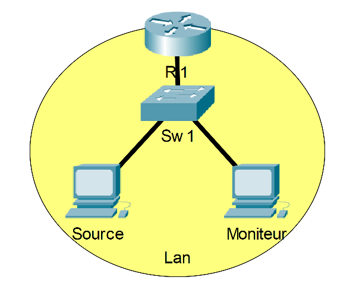
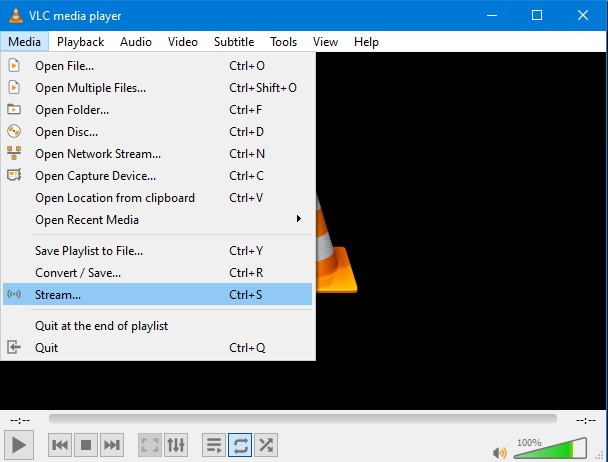
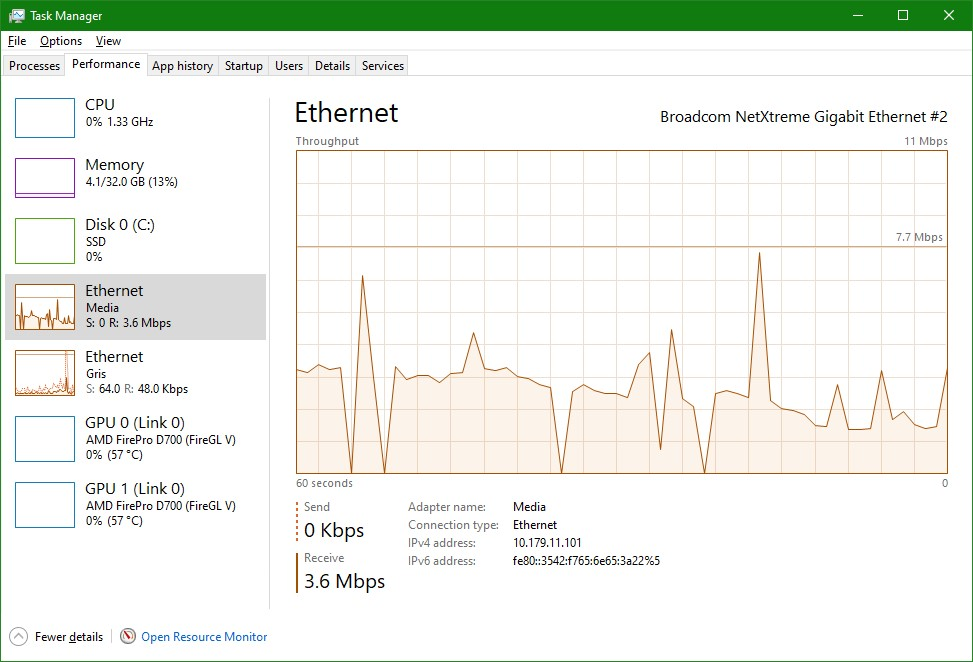

# Phase 1.0 - VLC à VLC (RTP)

## Prérequis
- Un fichier vidéo en provenance du [Netflix Open Content](https://opencontent.netflix.com/)
    - ex : *Meridian_UHD4k5994_HDR_P3PQ.mp4*
- Deux ordinateurs avec VLC (Windows ou Linux)
- Une connexion réseau entre les deux ordinateurs
- Les adresses IP des deux ordinateurs
- Connaissances de base sur le concept du [RTP](https://en.wikipedia.org/wiki/Real-time_Transport_Protocol)

## Étape 1 - Configuration de l'émetteur (Mux)
1. Sur la machine qui servira d'émetteur, ouvrir VLC
2. Dans la barre de menu, cliquer sur **Media** puis sur **Stream**.\

3. Cliquer sur **+ Add...**\

4. Choisir le fichier vidéo.\

5. Cliquer sur **Stream**.\

6. Cliquer sur **Next**.\

7. Cocher la case *Display Locally* puis sélectionner la valeur de *New Destination* à **RTP**.\
Ensuite, cliquer sur le bouton **Add**.\

8. Dans la zone *Address*, entrer l'adresse IP de la machine qui servira de moniteur.\
Donner un nom à votre flux vidéo (sans espaces idéalement).\
Ensuite, cliquer sur le bouton **Next**.\

9. Cocher la case pour *Activate Transcoding* puis cliquer sur le bouton **Next**.\
\
**Ne pas** encore cliquer sur le bouton **Stream**

## Étape 2 - Capture des paquets et lecture du flux vidéo
1. Sur la machine qui sert de moniteur, ouvrir Wireshark et sélectionner l'interface par laquelle le flux vidéo sera reçu en double-cliquant dessus.\

2. Sur la machine source, de retour dans vlc, cliquer sur le bouton **Stream**.\

3. S'assurer que la fonction de répétition (la boucle) soit en bleu.\

4. Attendre quelques secondes et arrêter la capture sur la machine moniteur.\
\
Que pouvez-vous en conclure avec cette capture ?\
*La machine reçoit les paquets sans être abonnée*

## Étape 3 - Lecture du flux vidéo
1. Sur la machine qui servira de moniteur, ouvrir VLC.
2. Dans la barre de menu, cliquer sur **Media** puis sur **Open Network Stream**.\

3. Entrer l'URL de la video. Celui-ci devrait être composé du type de transport, de l'adresse source et du port. \
Dans notre cas, l'adresse source est l'adresse IP de l'interface de la machine moniteur.\
ex : *rtp://10.179.11.101:5004*\
**Ne pas encore cliquer sur *PLAY* !**\
\
4. Retourner dans Wireshark et lancer une nouvelle capture.\

5. Dans vlc, cliquer sur le bouton **Play**.\

6. Arrêter la capture Wireshark. Que pouvez-vous en conclure ?\
*Laisser le flux vidéo fonctionner*

## Étape 4 - Analyse des débits
1. Sur la machine moniteur, ouvrir un gestionnaire de tâches. Ouvrir l'onglet *Performance* et sélectionner l'interface utilisée pour le flux vidéo.\
***Noter la bande passante utilisée (approximative)***

2. Sur la machine source, ouvrir un gestionnaire de tâches et ouvrir l'interface utilisée pour le flux vidéo.\
***Noter la bande passante utilisée (approximative)***
\
Que pouvez-vous conclure avec vos résultats ?\
*Vous pouvez fermer le flux vidéo à ce point. \
Toutefois, il peut être intéressant de laisser jouer le flux vidéo un certain temps afin de valider la robustesse de la configuration actuelle.*

## Étape 5 - Retour sur l'exercice
1. Effectuer un résumé de l'exercice ainsi qu'une courte explication de la situation.\
Spécifiez les protocoles, bandes passantes et autres informations nécessaires afin qu'un autre étudiant puisse comprendre la situation rapidement sans aucune information antérieure.
2. Si vous avez eu des problèmes, apporter des théories potentielles sur la cause / les causes du / des problèmes, les impacts observés ainsi que des potentiels moyens de résolution.
