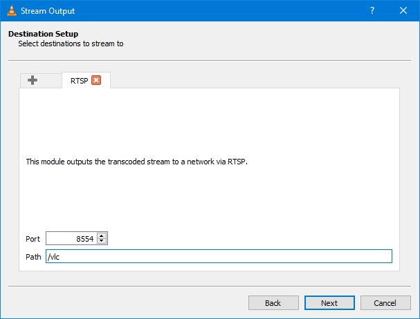
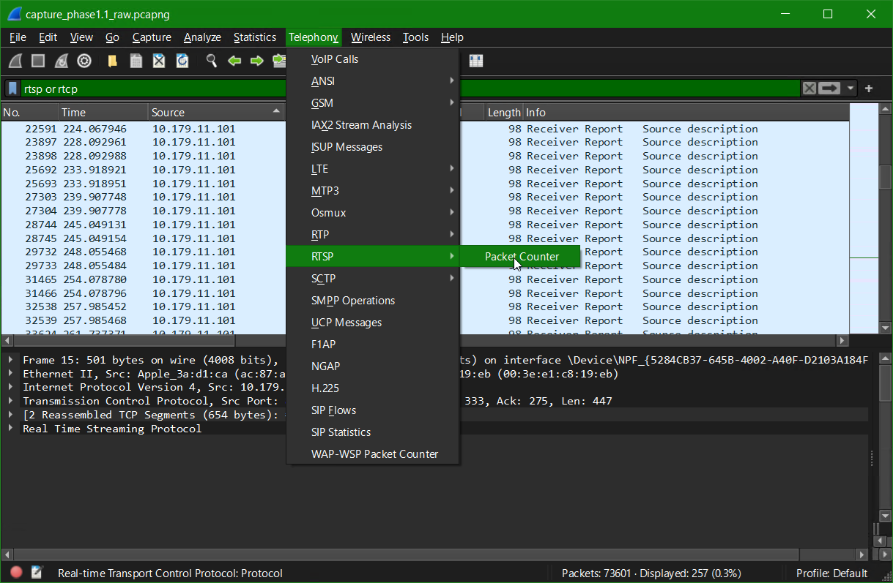
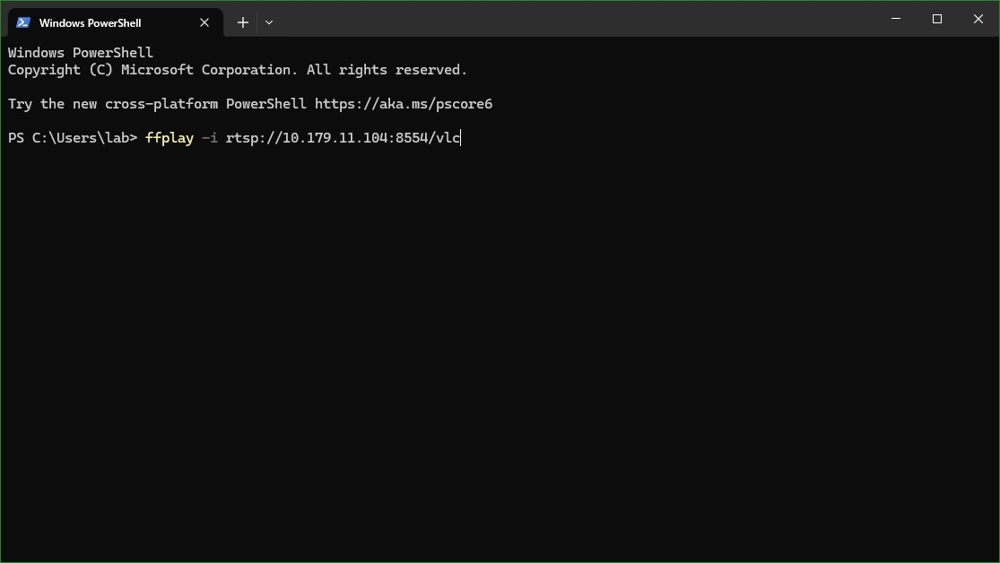
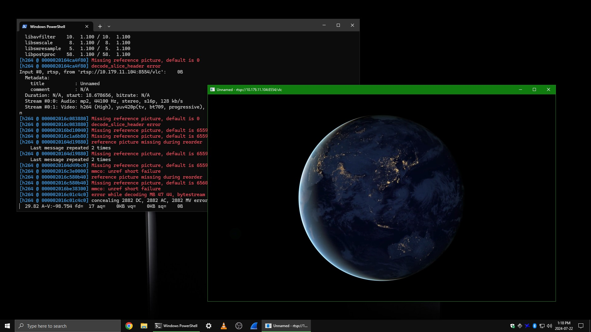

# Phase 1.3 - VLC à FFmpeg (RTSP)

## Prérequis
- Un fichier vidéo en provenance du [Netflix Open Content](https://opencontent.netflix.com/)
    - ex : *Meridian_UHD4k5994_HDR_P3PQ.mp4*
- Deux ordinateurs avec VLC (Windows ou Linux)
- Une connexion réseau entre les deux ordinateurs
- Les adresses IP des deux ordinateurs
- Connaissances de base sur le concept du [SDP](https://en.wikipedia.org/wiki/Session_Description_Protocol) et [RTSP](https://www.rfc-editor.org/info/rfc2326)

## Étape 1 - Configuration de l'émetteur (Mux)
1. Sur la machine qui servira d'émetteur, ouvrir VLC
2. Dans la barre de menu, cliquer sur **Media** puis sur **Stream**.\

3. Cliquer sur **+ Add...**\

4. Choisir le fichier vidéo.\

5. Cliquer sur **Stream**.\

6. Cliquer sur **Next**.\

7. Cocher la case *Display Locally* puis sélectionner la valeur de *New Destination* à **RTSP**.\
Ensuite, cliquer sur le bouton **Add**.\

8. Dans la zone *Path*, entrer **/vlc**.\
Ensuite, cliquer sur le bouton **Next**.\

9. Cocher la case pour *Activate Transcoding* puis cliquer sur le bouton **Next**.\

10. Cliquer sur le bouton **Stream**.\

11. S'assurer que la fonction de répétition (la boucle) soit en bleu.\

## Étape 2 - Configuration du récepteur
1. Sur la machine qui servira de moniteur, ouvrir un terminal.\

2. Ouvrir Wireshark et démarrer une capture.\

3. Dans le terminal, ouvrir le flux vidéo avec la commande `ffplay -i rtsp://[adresseIP]:[Port]/[chemin]`.\

4. Attendre quelques secondes le temps que le flux démarre.\
\
*Laisser le flux vidéo fonctionner*