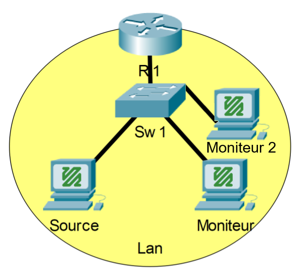

# Phase 2.1 - FFmpeg à FFmpeg (RTP avec IGMP Snooping)

## Prérequis
- Un fichier vidéo en provenance du [Netflix Open Content](https://opencontent.netflix.com/)
    - ex : *Meridian_UHD4k5994_HDR_P3PQ.mp4*
- Trois ordinateurs avec VLC (Windows ou Linux)
- Une connexion réseau entre les deux ordinateurs
- Les adresses IP des deux ordinateurs
- Connaissances de base sur le concept du [RTP](https://en.wikipedia.org/wiki/Real-time_Transport_Protocol)
- Connaissances de base sur le concept du [Multicast](https://fr.wikipedia.org/wiki/Multicast)
- Connaissances du binaire, de l'hexadécimal et des conversions

## Étape 0 - Configuration du commutateur
1. Se connecter au commutateur et activer la fonction **IGMP Snooping** pour votre réseau.

## Étape 1 - Configuration de l'émetteur (Mux)
1. Sur la machine qui servira d'émetteur, ouvrir un terminal.
2. Lancer le flux vidéo avec ffmpeg avec la commande suivante : `ffmpeg -re -stream_loop -1 -i [Path/to/file.mp4] -c copy -f rtp rtp://[IP_Multicast]:[Port]`
    - *ex : `ffmpeg -re -stream_loop -1 -i "C:\Users\lab\Videos\file_example_MP4_1920_18MG.mp4" -c copy -f rtp rtp://239.89.0.1:5004`*
3. Valider que le flux est bien commencé.
    - *La sortie devrait ressembler à ceci*\
     `Press [q] to stop, [?] for help`\
      `size=N/A time=25:21:46.23 bitrate=N/A speed=   1x`

## Étape 2 - Capture des paquets et lecture du flux vidéo
1. En fonction de votre adresse IP multicast, calculer l'adresse MAC multicast associée et en prendre note..
2. Calculer l'adresse MAC de l'adresse IP multicast **239.127.0.1** et en prendre note.
    - *Comparer l'adresse MAC calculée avec celle calculée à l'étape 2 dans [l'exercice précédent.](../Phase%202.0/README.md)*
3. Sur la machine qui sert de moniteur, ouvrir Wireshark et sélectionner l'interface par laquelle le flux vidéo sera reçu en double-cliquant dessus.
4. Sur la machine qui sert de 2e moniteur, ouvrir Wireshark et sélectionner l'interface qui est connectée au réseau utilisé pour la flux vidéo.

## Étape 3 - Lecture du flux vidéo
1. Sur la machine qui servira de premier moniteur, ouvrir un terminal.
2. Démarrer la lecture du flux vidéo avec la commande ffmpeg suivante : `ffplay -i rtp://[IP_Multicast]:[Port]`
    - *ex : `ffplay -i rtp://239.89.0.1:5004`*
