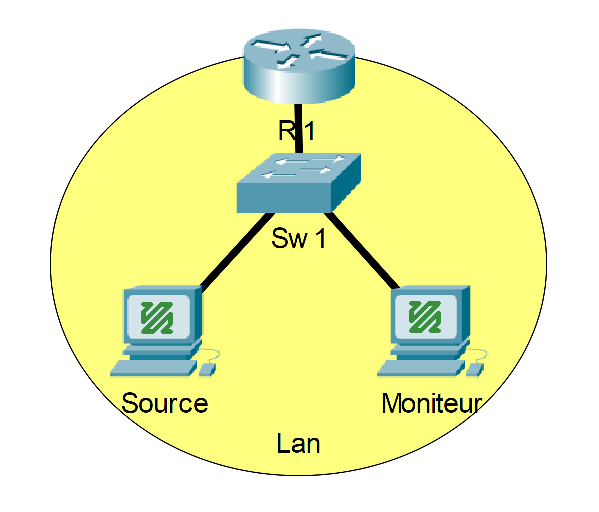

Phase 1.4 - FFmpeg à FFmpeg (RTSP)
----------------------------------

# Prérequis

- Un fichier vidéo en provenance du [Netflix Open Content](https://opencontent.netflix.com/)
    - ex : *Meridian_UHD4k5994_HDR_P3PQ.mp4*
- Deux ordinateurs avec FFmpeg (Windows ou Linux)
- Une connexion réseau entre les deux ordinateurs
- Les adresses IP des deux ordinateurs
- Connaissances de base sur le concept du [SDP](https://en.wikipedia.org/wiki/Session_Description_Protocol) et [RTSP](https://www.rfc-editor.org/info/rfc2326)
- [MediaMTX](https://github.com/bluenviron/mediamtx/releases/latest) de téléchargé sur la machine qui servira de source

# Étape 1 - Configuration de l'émetteur (Mux)

1. Sur la machine qui servira d'émetteur, ouvrir un premier terminal
2. Lancer le serveur mediamtx
    - *ex : `.\mediamtx.exe`*
3. Prendre note du port utilisé par mediamtx pour le rtsp
    - *ex : `2024/07/22 15:25:58 INF [RTSP] listener opened on :8554 (TCP), :8000 (UDP/RTP), :8001 (UDP/RTCP)`*
4. Lancer un deuxième terminal ou ouvrir un autre onglet de terminal
5. Lancer le flux vidéo avec ffmpeg avec la commande suivante : `ffmpeg -re -stream_loop -1 -i [Path/to/file.mp4] -c copy -f rtsp rtsp://[adresse]:[Port]/[Path]`
    - *ex : `ffmpeg -re -stream_loop -1 -i "C:\Users\lab\Videos\file_example_MP4_1920_18MG.mp4" -c copy -f rtsp rtsp://localhost:8554/mystream`*
6. Valider que le flux est bien commencé.
    - *La sortie devrait ressembler à ceci*\
     `Press [q] to stop, [?] for help`\
      `size=N/A time=25:21:46.23 bitrate=N/A speed=   1x`

# Étape 2 - Configuration du récepteur et capture des échanges

1. Sur la machine qui servira de moniteur, ouvrir un terminal.
2. Ouvrir Wireshark et démarrer une capture sur l'interface réseau utilisée.
3. Dans le terminal, ouvrir le flux vidéo avec la commande `ffplay -i rtsp://[adresseIP]:[Port]/[chemin]`.
    - *ex: `ffplay -i rtsp://10.179.11.104:8554/mystream`*
4. Attendre quelques secondes le temps que le flux démarre.\
*Laisser le flux vidéo fonctionner quelques secondes*
5. Arrêter le flux vidéo.
    - *La touche **Esc** ou la combinaison ***Ctrl+C*** peut être utilisée.*
6. Arrêter la capture Wireshark.

# Étape 3 - Analyse de la capture

1. Dans la capture Wireshark, appliquer le filtre `rtsp or rtcp`.
2. Observer l'échange RTSP.
    - ❓ Quelles sont les étapes de l'échange et quelles sont les informations échangées ?
3. Dans l'échange RTSP, sélectionner le paquet incluant le SDP.
4. Dans le paquet sous la section *Real Time Streaming Protocol*, observer les informations du SDP.
    - *Pour une vue plus claire, copier le SDP en tant que texte imprimable et coller dans un bloc-note.*
5. Identifier les composantes du SDP en détails.

TODO: Montrer le SDP et essaye de recouper les info media avec autre chose

# Étape 4 - Retour sur l'exercice
1. Effectuer un résumé de l'exercice ainsi qu'une courte explication de la situation.\
Spécifiez les protocoles, bandes passantes et autres informations nécessaires afin qu'un autre étudiant puisse comprendre la situation rapidement sans aucune information antérieure.
2. Si vous avez eu des problèmes, apporter des théories potentielles sur la cause / les causes du / des problèmes, les impacts observés ainsi que des potentiels moyens de résolution.
