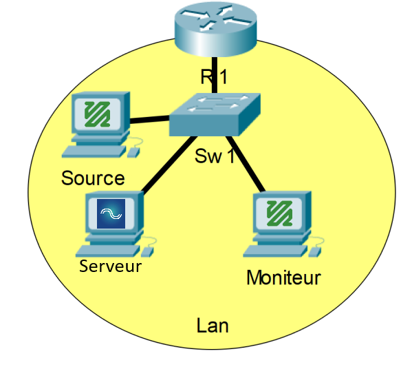

# Phase 1.5 - FFmpeg Distant à FFmpeg (RTSP)

## Prérequis
- Un fichier vidéo en provenance du [Netflix Open Content](https://opencontent.netflix.com/)
    - ex : *Meridian_UHD4k5994_HDR_P3PQ.mp4*
- Trois ordinateurs avec FFmpeg (Windows ou Linux)
- Une connexion réseau entre les deux ordinateurs
- Les adresses IP des deux ordinateurs
- Connaissances de base sur le concept du [SDP](https://en.wikipedia.org/wiki/Session_Description_Protocol) et [RTSP](https://www.rfc-editor.org/info/rfc2326)
- [MediaMTX](https://github.com/bluenviron/mediamtx/releases/latest) de téléchargé sur la machine qui servira de source

## Étape 1 - Configuration du serveur
1. Sur la machine qui servira de serveur, ouvrir un terminal
2. Lancer le serveur mediamtx
    - *ex : `.\mediamtx.exe`*
3. Prendre note du port utilisé par mediamtx pour le rtsp
    - *ex : `2024/07/22 15:25:58 INF [RTSP] listener opened on :8554 (TCP), :8000 (UDP/RTP), :8001 (UDP/RTCP)`*

## Étape 2 - Configuration de la source
1. Lancer un deuxième terminal ou ouvrir un autre onglet de terminal
2. Lancer le flux vidéo avec ffmpeg avec la commande suivante : `ffmpeg -re -stream_loop -1 -i [Path/to/file.mp4] -c copy -f rtsp rtsp://[adresse_IP_Serveur]:[Port]/[Path]`
    - *ex : `ffmpeg -re -stream_loop -1 -i "C:\Users\lab\Videos\file_example_MP4_1920_18MG.mp4" -c copy -f rtsp rtsp://10.179.11.101:8554/mystream`*
3. Valider que le flux est bien commencé.

## Étape 3 - Configuration du récepteur et capture des échanges
1. Sur la machine qui servira de moniteur, ouvrir un terminal.
2. Ouvrir Wireshark et démarrer une capture sur l'interface réseau utilisée.
3. Dans le terminal, ouvrir le flux vidéo avec la commande `ffplay -i rtsp://[adresseIP_serveur]:[Port]/[chemin]`.
    - *ex: `ffplay -i rtsp://10.179.11.101:8554/mystream`*
4. Attendre quelques secondes le temps que le flux démarre.\
*Laisser le flux vidéo fonctionner quelques secondes*
5. Arrêter le flux vidéo.
    - *La touche **Esc** ou la combinaison ***Ctrl+C*** peut être utilisée.*
6. Arrêter la capture Wireshark.

## Étape 4 - Retour sur l'exercice
1. Effectuer un résumé de l'exercice ainsi qu'une courte explication de la situation.\
Spécifiez les protocoles, bandes passantes et autres informations nécessaires afin qu'un autre étudiant puisse comprendre la situation rapidement sans aucune information antérieure.
2. Si vous avez eu des problèmes, apporter des théories potentielles sur la cause / les causes du / des problèmes, les impacts observés ainsi que des potentiels moyens de résolution.
