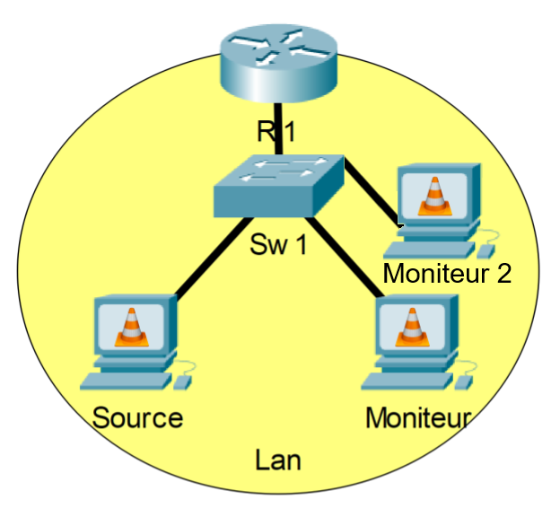

Phase 2.0 - Test initial de transmission multicast
----------------------------------------------

# Prérequis

- Un fichier vidéo en provenance du [Netflix Open Content](https://opencontent.netflix.com/)
    - *💡 ex : Meridian_UHD4k5994_HDR_P3PQ.mp4*
- Trois ordinateurs avec VLC (Windows ou Linux)
- Une connexion réseau entre les deux ordinateurs
- Les adresses IP des trois ordinateurs
- Une adresse IP multicast (déterminée par l'enseignant)
- Connaissances de base sur le concept du [RTP](https://en.wikipedia.org/wiki/Real-time_Transport_Protocol)
- Connaissances de base sur le concept du [Multicast](https://fr.wikipedia.org/wiki/Multicast)
- Connaissances du binaire, de l'hexadécimal et des conversions

# Étape 1 - Configuration de la source

1. Déterminer une adresse multicast pour la distribution d'un nouveau signal
    - *💡 ex: `239.86.0.X` port `5004`*
    - *💡 Voir avec l'instructeur pour la valeur X*
2. Reconfigurer [VLC en mode transmetteur RTP](../Phase-1-Flux-pair-a-pair/Phase%201.0/README.md)

# Étape 2 - Configuration du moniteur

1. Poursuivre l'exercice précédent en configurant VLC du PC moniteur.
2. Lire ce flux en appliquant l'url `rtp://239.86.0.X:5004`
3. Capturer les paquets avec Wireshark
4. Inspecter les adresses source et destination, MAC et IP. 
5. Stopper VLC tout en laissant la capture des paquets se poursuivre
    - *💡 Noter le comportement similaire à l'unicast*

# Étape 3 - Un peu de théorie

1. Calculer l'adresse MAC multicast associée à l'adresse IP multicast `239.86.0.X` grâce à [cet outil en ligne](https://networklessons.com/multicast/multicast-ip-address-to-mac-address-mapping)
2. Valider cette MAC avec celle observer dans Wireshark
3. Calculer l'adresse MAC multicast associée à l'adresse IP multicast de `239.217.0.X`
4. Essayer d'anticiper les problèmes potentiels
    - *💡 Ce risque de conflit d'adresse peut engendrer des problème de routage dans un communtateur L2.*

# Étape 4 - Installation d'un 2ème PC moniteur

1. Brancher un second moniteur au réseau
2. Lancer Wireshark
3. Confirmer à nouveau la présence du flux sans rien avoir configuré
4. Constater que ces paquets `flood` à travers 

# Étape 4 - Mesure sur le commutateur

Dans des cas réels d'application, il est souvent impossible de pouvoir faire des mesures au niveaux
des équipements terminaux eux-même. Par contre, il est toutjours possible d'enfaire au niveau des équipements réseaux.

1. Se connecter sur le commutateur (switch) par le port de console ou bien par ssh
2. Mesurer le débit du traffic entrant sur le port de la source 
    - *💡 ex: `show interface ethernet 4`*
3. Comparer avec les débits sortant vers les 2 moniteurs
4. Ainsi comprendre que le même phénomène "d'innondation" est observable depuis le réseau
