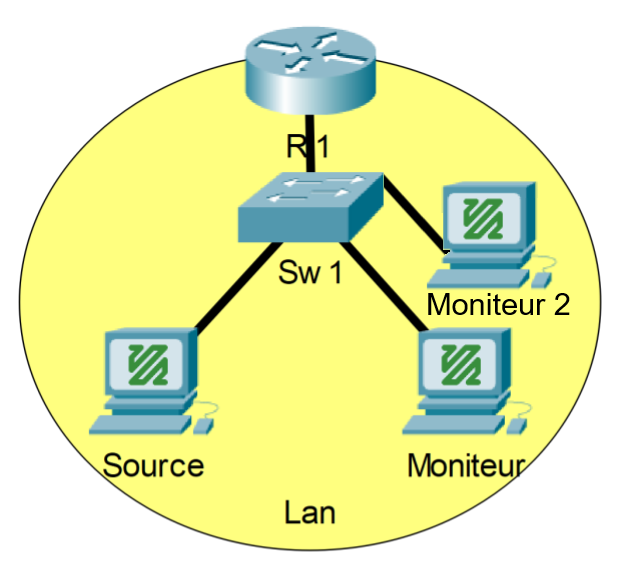

# Phase 2.2 - Analyse IGMP Snooping
-----------------------------------

# Prérequis

- Retrouver l'état du laboratoire tel qu'à la fin de l'[exercice 2.1](./Phase-2.1/README.md)

# Étape 1 - Analyse des débits

1. Sur le commutateur (switch) utilisé dans votre réseau, aller observer le débit utilisé par le port de la source et le port du premier moniteur.
    - ex: `watch show interface ethernet 4, ethernet 46`
2. Sur le 2e moniteur, démarrer la lecture du flux vidéo.
3. De retour sur le commutateur, prendre en note les débits des ports sources, moniteur 1, moniteur 2 ainsi qu'un autre port quelconque.

*Comprendre l'avantage que permet le multicast. Le traffic média entrant ne dépend pas du nombre de
demandeur.*

# Étape 2 - Analyse IGMP sur un Moniteur

1. Lancer une capture wireshark sur un des moniteurs
2. Stopper/redémarrer l'application média (vlc ou ffpmeg)
3. Observer les paquets IGMP dans wireshark
4. Noter la corrélation entre ces paquets et la précence de paquets multicast média
5. Observer que des paquets IGMP sont aussi transmis à toutes les ~2 minutes
    - *💡 Utiliser le champs filtre: `igmp`*
6. Noter la source de ces requêtes
7. En déduire également la nature synchro et asynchrone de ce protocole

# Étape 3 - Analyse IGMP sur le commutateur

Retournons sur le commutateur pour observer l'état du `querier`

1. Sur le commutateur, afficher les membres des groupes multicast 
    - `show ip igmp snooping groups`
2. Sur le commutateur, afficher les statisques du protocole IGMP
    - `show ip igmp snooping counters`

*Vous pouvez fermer le flux vidéo à ce point.*

# Liens utiles

[IGMP Querrier adresse tips](https://community.netgear.com/t5/Managed-Switches/igmp-querier-address/td-p/1335428)
[IGMP Cisco](https://www.cisco.com/c/en/us/td/docs/routers/nfvis/switch_command/b-nfvis-switch-command-reference/igmp_snooping_commands.html#wp3565165330)
