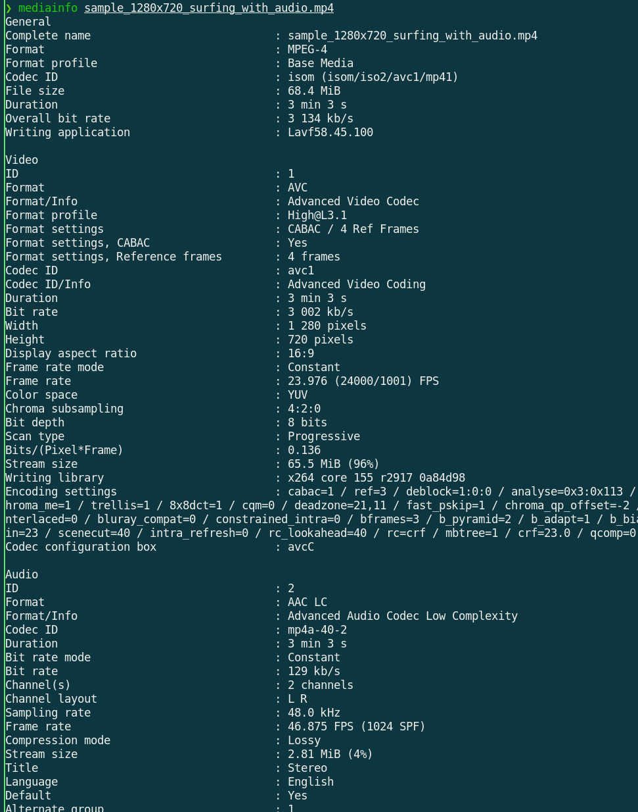

Phase 3.0 - Média et Ordres de Grandeur
---------------------------------------

# Prérequis

- 1 ordinateur (Win ou Linux) avec `vlc`, `ffmpeg`, `mediainfo` installés
- Un fichier audio-vidéo en provenance du [Vimeo](https://vimeo.com/995688942)
    - *💡 ex: `sample_1280x720_surfing_with_audio.mp4`*
- Dans l'exercice suivant, remplacer `media_file.mp4` par ce nom de fichier.
- Notion de vidéo: images, pixels et taux de rafraîchissement
- Notion d'audio: échantillonage

# Étape 1 - Extraire les méta-données

1. Valider que le fichier d'échantillon est lisible
    - *💡 ex: `vlc media_file.mp4`*
2. Afficher les méta-données des pistes vidéo et audio
    - *💡 ex: `mediainfo media_file.mp4`*
3. Trouver leurs débits respectifs
4. Comparer ces chifffres en calculant le ratio audio/video

# Étape 2 - Calcul du débit vidéo brut

1. Trouver la taille de l'image dans ce même fichier en déduire le nombre de pixels par image
    - *💡 `pixels_hauteur * pixels_largeur`*
2. Trouver la profondeur de couleur (qui correspond à une composante de couleur)
    - *💡 `Bit Depth`*
3. Sachant que chaque pixel a 3 composantes de couleur, calculer le nombre de bits par image
4. Trouver le taux de rafraîchissement de l'image et arrondir ce chiffre
    - *💡 `Frame Rate`*
    - *💡 [Pourquoi un chiffre si étrange?](https://www.youtube.com/watch?v=3GJUM6pCpew)*
5. Déduire le nombre de bits que représente 1 seconde d'images, c'est-à-dire le débit en kb/s
6. ❓Comment expliquer une telle différence avec le débit vidéo de l'étape 1?
    - *💡 `Codec...`*

# Étape 3 - Extraire l'audio brut

De la même manière, on pourrait obtenir le débit brut audio avec:
`Nombre_canaux * Profondeur_echantillon * Frequence_échantillonnage = 2 ch * 16 bit * 48 kHz = 1536 kb/s`

1. Isoler la piste audio
    - *💡 `ffmpeg -i sample_1280x720_surfing_with_audio.mp4 -c copy -map 0:a output_audio.mp4`*
2. Décompresser et stocker dans un fichier `wav`
    - *💡 `ffmpeg -i output_audio.mp4 output_audio.wav`
3. Valider le débit brut:
    - *💡 `mediainfo output_audio.wav | grep rate`
4. Comparer les tailles de fichier
    - *💡 `ls -l output_audio.*`
