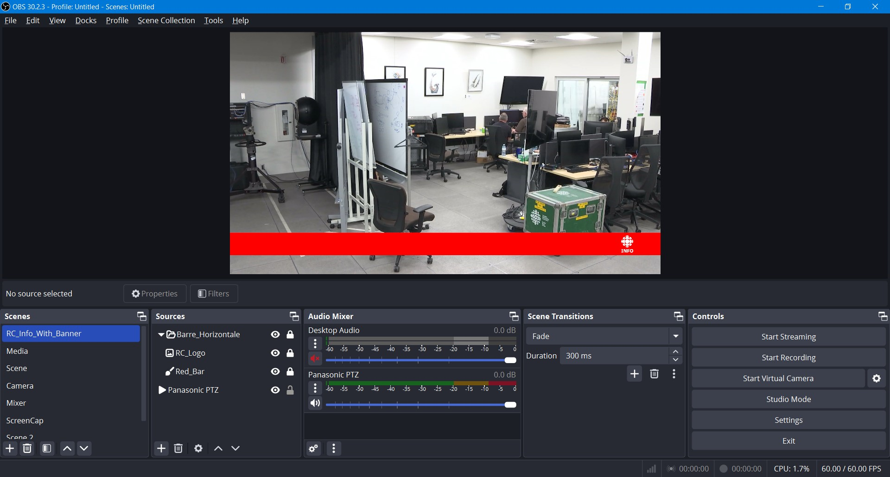

Phase 4.0 - Configuration d'OBS
-------------------------------

# Configuration de la résolution du canevas.
La résolution du canevas dans OBS représente la résolution de l'espace de base pour vos sources. Elle est différente de la résolution de sortie, mais a un impact direct sur la performance car elle sera convertie en celle de sortie.
1. Dans la barre de menu d'OBS, ouvrir l'option **File** puis cliquer sur l'option **Settings**.
2. Dans la barre d'options à gauche, cliquer sur l'option **Video**.
3. Ajuster la résolution de canevas **Base (Canevas) Resolution** selon votre objectif.
4. Ajuster la résolution de sortie **Output (Scaled) Resolution** selon votre objectif.
5. Ajuster le taux d'images par secondes (FPS) à la valeur désirée.
6. Une fois les changements effectués, cliquer sur le bouton **Apply** puis sur le bouton **OK**.

# Création d'une scène
Dans OBS, une scène est un moyen facile de passer entre plusieurs sources/groupes/états.
1. Dans la zone **Scenes**, cliquer sur le bouton **+** en bas à gauche de la zone.
2. Donner un nom significatif à votre scène.
3. La scène est désormais créée ! Vous pouvez changer entre différentes scènes en cliquant sur la scène désirée.

# Configuration d'une source média
Une source peut être un fichier, un flux vidéo, une forme, une image, une trame musicale, une page web etc.\
L'ordre des sources dans une scène affecte directement ce qui est visible. Une source plus haute dans la liste sera au-dessus des autres sources.\
Dans cette section, une source média (flux vidéo) sera ajouté, mais il est recommandé d'explorer les options possibles.
1. Dans la section **Sources**, cliquer sur le bouton **+** en bas à gauche.
    - *Attention à ne pas cliquer sur le **+** de la zone **Scenes**.*
2. Dans le menu contextuel, cliquer sur l'option **Media Source**.
3. Donner un nom à votre source media et cliquer sur **ok**.
4. Dans la fenêtre des propriétés qui s'ouvre automatiquement (sinon faire un clic droit > propriétés), décocher l'option **Local File**.
    - *Si vous voulez ajouter un fichier comme source média, ne pas décocher l'option et ajouter le fichier*
5. Ajuster la valeur du **Network Buffering** si désiré.
6. Dans la zone de texte de l'option **Input**, entrer le chemin de la source média.
    - ex : ```rtsp://10.179.11.103:554/MediaInput/h264/stream_2```
7. Configurer le délais de reconnexion si désiré.
8. Cocher **Use hardware decoding when available**.
9. Dans un souçis d'efficacité, cocher **Close file when inactive**.
10. Configurer les paramètres vidéos si désiré.
11. Dans la zone de texte de l'option **FFmpeg Options**, entrer les paramètres (séparés avec des espaces) que ffmpeg pourrait nécessiter s'il tentait de se connecter à cette source.
    - ex : ```rtsp_transport=udp_multicast```
12. Cliquer sur le bouton **OK**.
13. Si votre source n'est pas adapté à votre résolution de canevas, cliquer sur la source une fois et effectuer un **Ctrl** + **F** afin d'ajuster la source à l'écran.
14. Si vous voulez protéger votre source de déplacements ou modifications involontaires, cliquer sur le cadenas de votre source.
15. Afin de masquer une source, cliquer sur l'oeil de votre source.
16. Voilà, la source est créée et configurée selon vos objectifs !
    - *Attention, si une source est utilisée dans plusieurs scènes, la modification de la source dans une scène l'affecte dans toutes les autres scènes.* 

# Création d'un groupe
1. Dans la liste de sources, sélectionner les sources à regrouper.
    - *Appuyer et maintenir la touche **Ctrl** et cliquer sur les sources à regrouper.*
2. Une fois la liste de sources à regrouper sélectionnée, faire un clic droit sur l'une d'entre-elles.
3. Dans le menu contextuel généré par le clic-droit, cliquer sur l'option **Group Selected Items**.
4. Donner un nom significatif au groupe.
5. Le groupe est désormait créé !
    - *Attention, si un groupe est utilisé comme source dans plusieurs scènes, la modification du groupe dans une scène l'affecte dans toutes les scènes.*

# Aperçu d'une scène complète


# Configuration des paramètres vidéos
Les paramètres OBS sont un élément important à comprendre. Le logiciel comprends plusieurs espaces de configurations, tous avec des résultats différents.
Pour résumer ce qui sera utile ici, OBS a des paramètres distincs pour l'enregistrement et la diffusion. Chaque ensemble de paramètres peut être aussi configuré simplement ou en mode avancé.\
Le valeurs à choisir des paramètres ne seront pas indiquées ici. En théorie, la phase 3 a été complété ;) .
1. Dans la barre de menu d'OBS, ouvrir l'option **File** puis cliquer sur l'option **Settings**.
2. Dans la barre d'options à gauche, cliquer sur l'option **Output**.
3. Dans la section **Streaming**, configurer les paramètres d'encodage qui seront utilisés pour la diffusion.
    - *Pour plus de granularité, changer la valeur de l'option **Output Mode** de **Simple** à **Advanced***.
4. Une fois les changements effectués, cliquer sur le bouton **Apply** puis sur le bouton **OK**.
