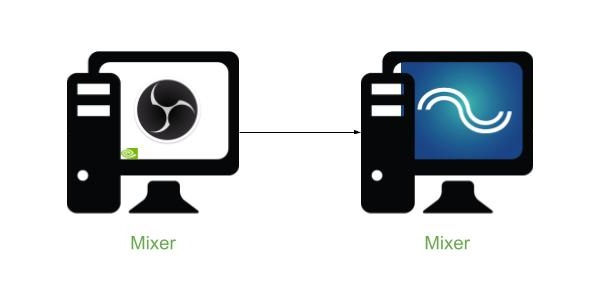
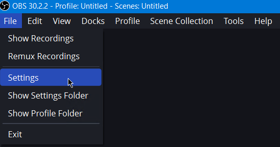

Phase 4.1 - Configuration d'OBS avec un serveur de diffusion en direct local
-------------------------------



# Prérequis

- Deux ordinateurs (Windows ou Linux)
    - Un ordinateur avec OBS
    - Un ordinateur avec [MediaMTX](https://github.com/bluenviron/mediamtx/releases/latest) de téléchargé et extrait (pas d'installation à effectuer)
- Une connexion réseau entre les deux ordinateurs
- Les adresses IP des deux ordinateurs

# Étape 1 - Lancement de MediaMTX et note des paramètres
1. Sur l'ordinateur qui servira de serveur de diffusion, ouvrir un terminal
2. Naviguer dans le dossier où mediamtx a été extrait
3. Ouvrir le fichier mediamtx.yml avec un éditeur (vscode, nano, vim, etc.)
4. Dans le fichier, naviguer à la section des paramètres RTMP
    ```yaml
    ###############################################
    # Global settings -> RTMP server
    .
    .
    .
    ###############################################
    ```
5. Vérifier que RTMP est activé, prendre note du numéro de port utilisé et s'assurer que la sécurité est désactivée
    ```yaml
    # Enable publishing and reading streams with the RTMP protocol.
    rtmp: yes
    # Address of the RTMP listener. This is needed only when encryption is "no" or "optional".
    rtmpAddress: :1935
    # Encrypt connections with TLS (RTMPS).
    # Available values are "no", "strict", "optional".
    rtmpEncryption: "no"
    ```
6. Sauvegarder les modifications
7. Lancer mediamtx depuis le terminal
 - Pour Windows
    ```powershell
    .\mediamtx.exe
    ```
- Pour Linux
    ```bash
    sudo ./mediamtx
    ```
8. Valider que la port de la configuration est bien celui utilisé en observant la sortie du programme
    ```powershell
    PS C:\Users\user\Documents\mediamtx_v1.8.5_windows_amd64> .\mediamtx.exe
    2024/08/14 20:51:39 INF MediaMTX v1.8.5
    2024/08/14 20:51:39 INF configuration loaded from C:\Users\user\Documents\mediamtx_v1.8.5_windows_amd64\mediamtx.yml
    2024/08/14 20:51:39 INF [RTSP] listener opened on :8554 (TCP), :8000 (UDP/RTP), :8001 (UDP/RTCP)
    2024/08/14 20:51:39 INF [RTMP] listener opened on :1935
    2024/08/14 20:51:39 INF [HLS] listener opened on :8888
    2024/08/14 20:51:39 INF [WebRTC] listener opened on :8889 (HTTP), :8189 (ICE/UDP)
    2024/08/14 20:51:39 INF [SRT] listener opened on :8890 (UDP)
    ```

# Étape 2 - Configuration de OBS
1. Ouvrir OBS
    - Cette étape suppose que la configuration initiale a déjà été effectuée
2. Dans la barre de menu, ouvrir la section "File" puis "Settings"\

3. Dans la barre de navigation à gauche, sélectionner la catégorie "Stream"
4. Dans l'option "Service", sélectionner l'option "
5. Dans la zone "Server", entrer le protocole, l'adresse du serveur de diffusion et le port du protocole RTMP utilisé
    - ex : ```rtmp://10.179.11.101:1935```
6. Dans la zone "Stream Key", entrer le chemin que le flux vidéo sera localisé
    - ex : ```mystreampath```
7. Cliquer sur le bouton "Apply" puis "OK"

# Étape 3 - Test de la configuration
1. Sur OBS, cliquer sur le bouton "Start Streaming"
2. Dans le terminal du serveur de diffusion mediamtx, valider que la diffusion vidéo
```powershell
2024/08/14 21:16:45 INF [RTMP] [conn 10.179.11.106:63207] opened
2024/08/14 21:16:46 INF [RTMP] [conn 10.179.11.106:63207] is publishing to path 'mystreampath', 2 tracks (H264, MPEG-4 Audio)
```
3. Sur une machine (cliente, serveur ou émetteur OBS) ouvrir un navigateur web
4. Dans la barre de navigation, entrer l'adresse IP du serveur de diffusion suivit du port HLS (voir la sortie initiale) et du chemin du flux vidéo
```http://10.179.11.101:8888/mystreampath/```
5. Valider que la lecture vidéo débute et s'effectue correctement, autrement, voir la sortie sur le serveur de diffusion pour des informations supplémentaires
