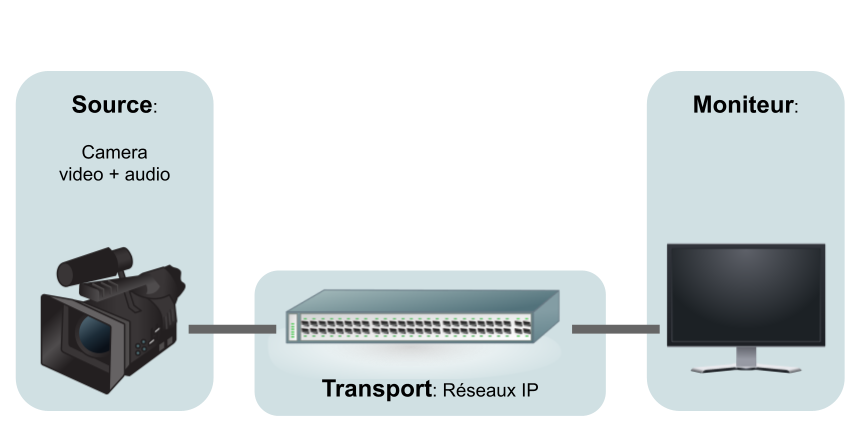
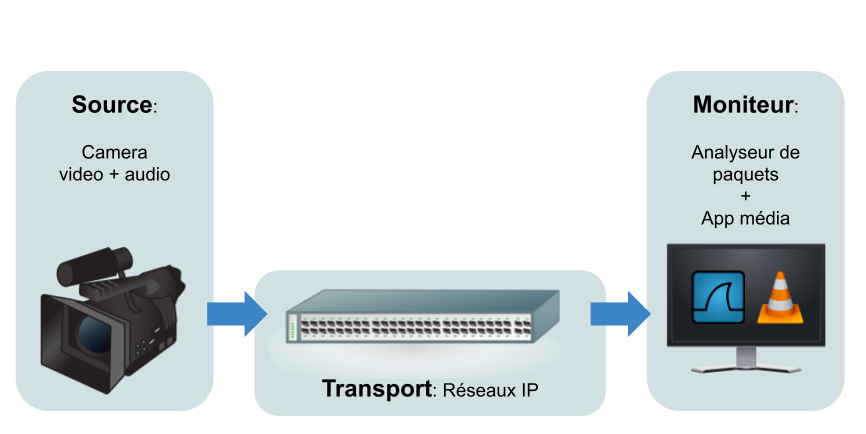
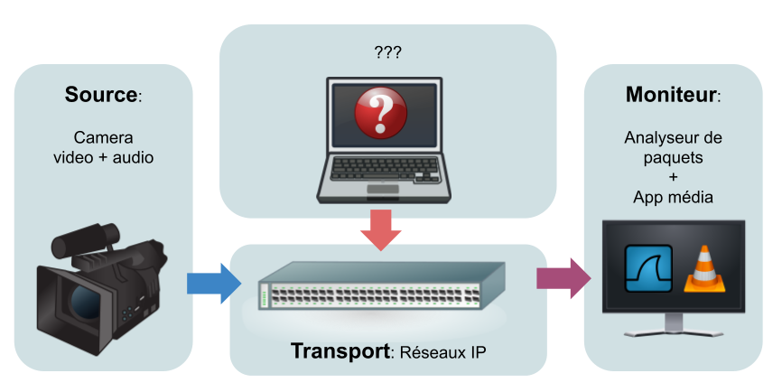
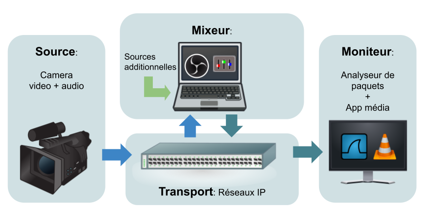

Laboratoire: Intro au Média sur IP
----------------------------------

[TODO] Split ce fichier en plusieurs

# Phase 1: Préparation du Matériel 

*[Diagramme source](https://docs.google.com/drawings/d/1CZXJb9VgcKqT9M0tsVFD6_huqsBrnm8NyrAL9IfMmnI/edit)*

## Commutateur

* Connecter votre poste de travail au commutateur
* Prendre note qu'une adresse vous a été assigné par DHCP
* Se logger sur le commutateur avec un client ssh (Prompt ou Putty.exe)
    * `ssh [SWITCH_USER]@[SWITCH_IP]` pass:`[SWITCH_PASS]`
* Découvrir la configuration initiale
    * la plage d'adresse dhcp
* Confirmer la connectivité avec votre poste de travail
    * `show lldp / cdp ...`
    * `show interface status ...`

## Caméra

* [TBD]
* Connecter au commutateur
* Trouver son IP ([TODO]: MAC @ + interroger le serveur DHCP, + table ARP)
* Utiliser un navigateur pour trouver la page de configuration de la caméra

## Moniteur

Le moniteur peut-être un PC dédié ou bien votre poste de travail. Il doit avoir:
* un client ssh
* vlc, ffmpeg
* whirshark

# Phase 2: Configuration d’une Chaîne Média Simple

*[Diagramme source](https://docs.google.com/drawings/d/1q6MF5KY4nLmCBxLiehqOJvOSK_qoAchkg8bCS-ulvEI/edit)*

## Configuration du Flux de la Caméra

Du point de vue IP, la caméra agit comme un serveur média implémentant le protocole RTSP.

* Dans la configuration du flux video, entrer les paramètres: [une combinaison de param qui marche
== RTSP]
* Pour le transport laisser le mode unicast pour commencer

## Configuration du Moniteur

Du point de vue IP, le moniteur agit comme un client.

* Valider la présence des paquets venant de la source avec Wireshark
    * Ouvrir Wireshark (mode admin/sudo)
    * Démarrer une capture sur l'interface média
* Ouvrir VLC/ffmpeg et tenter de lire le stream 
    * [TODO: url]
    * (Windows) ça ne marche pas, il faut ajouter une permission à VLC dans le pare-feu, puis réessayer ❓ En déduire le fonctionnement Wireshark par rapport aux autre applications
* Évaluer la qualité et mesurer les caractéristiques de l’image et du son

## Inspection de la Session

Dans Wireshark trouver et inspecter l'initialisation de la session `RTCP`

* Filtrer par `rtcp`
* Inspecter les commandes `DESCRIBE`, `SETUP` et leurs réponses

## Inspection de Paquet Media

Dans Wireshark trouver et inspecter un paquet RTP

* Filtrer la liste de paquets pour ne garder que le traffic media. 💡 Filtre = `ip.dst == ...`
* Décoder le flux comme du RTP. 💡 `Clique-droit sur un paquet > Decode as... > Current=RTP` 

Sélectionner et inspecter un paquet pour parcourir les couches OSI:

* ❓ Ethernet: trouver l'adresse MAC de destination
    * En quoi diffère-t-elle des paquets unicast? (la MAC ne correspond à aucun équipement)
    * Validder qu'elle dérive bien de l'adresse IP multicast? (en appliqunt la formule)
* ❓ IP: valider les adresses source et destination
* ❓ Transport:
    * Pourquoi les paquets n'ont-ils aucune réponse? (UDP)
    * Retrouver le port de destination.
* ❓ RTP: À partir de quelles information de l'entête RTP, les paquets peuvent-ils ordonnées par un
    récepteurs? 💡 Comparer plusiseurs paquets susccessifs. (_timesatmp_ + _sequence number_)

# Phase 3: Configuration d'un Flux Multicast

## Reconfigurer la Caméra

* Pour le transport de ce flux, configurer avec une IP destination dans la plage multicast et avec un port
* 💡 exemple: `225.0.0.1:5000`
* ❓ Saviez-vous qu’il existe une relation entre une adresse IP multicast et l’adresse MAC? Tenter de la calculer la vôtre (google).
* ❓ D'après vos connaissances sur le multicast, les paquets seront-t-ils de type TCP ou UDP?

##  Adapter Moniteur

* Relancer VLC/ffmpeg mais ça ne fonctionne pas
* Retourner Voir l'initialisation de la session dans Wireshark et en déduire que l'erreur vient du client
* Chercher les paramètres dans la documentation de VLC/ffmpeg [TODO url]
* Ré-essayer avec le bon paramètre

## Mesurer le Débit

Sur le commutateur:

* Observer le débit dans le port entrant (caméra)
    * `show interface et0`
* ❓ Ce chiffre peut aussi être confirmé par Wireshark, trouver comment.
* Comparer avec le débit sur le port de votre PC ou celui du Moniteur
    * ❓ En déduire le mode de fonctionnement actuel de la switch (flooding)
    * ❓ Penser aux conséquences. Est-ce souhaitable? (non....)

## Configurer l’IGMP snooping:
* Activer le IGMP snooping sur le commutateur ([TODO: Trouver la commande])
* Constater la perte de signal et observer à nouveau le débit sortant sur les ports

## Moniteur

* Relance VLC/ffmpeg pour rétablir l'image
    * ❓ Déduire le principe de _broadcast_ vs _multicast_.
* Chercher les paquets IGMP dans Wireshark
    * 💡 Filtre = `igmp`
    * ❓ Interpréter le fonctionnement du protocol IGMP.

# Phase 4: Insertion d’un équipement Inconnu

*[Diagramme source](https://docs.google.com/drawings/d/1g69jHkFmMmtmeYx_w6pYkU2EEvJdAaBjWFwXzCenr1w/edit)*

[TODO]
Créer une source parasite pour créer un conflit d'adresse IP mcast (script bash+ffmpeg pour streamer un fichier).
En faire un service (qui s'éxécute au démarrage). 

## Mixeur

* Brancher le Mixeur au commutateur, Port 2
* Allumer

## Moniteur

* Observer la dégradation de l’image dans VLC
* Chercher les paquets multicast dans Wireshark
    * 💡 filtre = `ip.dst == 225.0.0.1`
* Trouver l’existence d’un autre flux avec la même adresse de destination en regardant les adresses 
    * 💡 filtre = `ip.dst == 225.0.0.1 && ip.src != …`

## Commutateur

* Confirmer l’origine des paquets parasites à partir d’informations 
    * 💡 `ip mroute …`

## Mixeur

* Identifier le processus coupable et le fermer
    * 💡 `netstat -laputen` et `kill <pid>` (Linux)

# Phase 5: Utilisation d’un mixeur et ajout de nouvelles sources 

*[Diagramme source](https://docs.google.com/drawings/d/1g69jHkFmMmtmeYx_w6pYkU2EEvJdAaBjWFwXzCenr1w/edit)*

## Mixeur

* Ouvrir OBS (*Open Broadcast Studio*)
* Ajouter une source live et s’abonner au flux caméra 
* OBS: ouvrir une ou plusieurs sources additionnelles (webcam, fichier vidéo/son, images) et les intégrer dans l’image
* Générer un flux Mpeg-TS en sortie avec une autre IP multicast
    * url: `udp://225.0.0.2:5000`
    * codec: h264
    * facteur de compression: [TBD]

*Wikipedia[temporaire]*

## Commutateur

* Mesurer le débit du port Caméra maintenant qu’il a 2 demandeurs pour le flux
* Comparer avec précédemment quand il n’y avait qu’un seul demandeur
    * ❓ Constater l’avantage du UDP+multicast pour des souscriptions multiples

## Moniteur

* Ajuster VLC sur cette nouvelle IP:port pour visualiser le résultat 

# Phase 6: Configuration du Flux "Programme" de Sortie

*[Diagramme source](https://docs.google.com/drawings/d/1q6MF5KY4nLmCBxLiehqOJvOSK_qoAchkg8bCS-ulvEI/edit)*

## Commutateur

* Comparer le débit du flux caméra avec celui de la sortie du mixeur

## Mixeur

* Dans OBS, ouvrir les paramètres d'encodage
* Tester un facteur de compression plus élevé
* Observer le débit sur le commutateur et l'image au moniteur
* Répéter avec un facteur de compression moins élevé qu'à l'origine
    * ❓ Question de conclusion [TBD]
